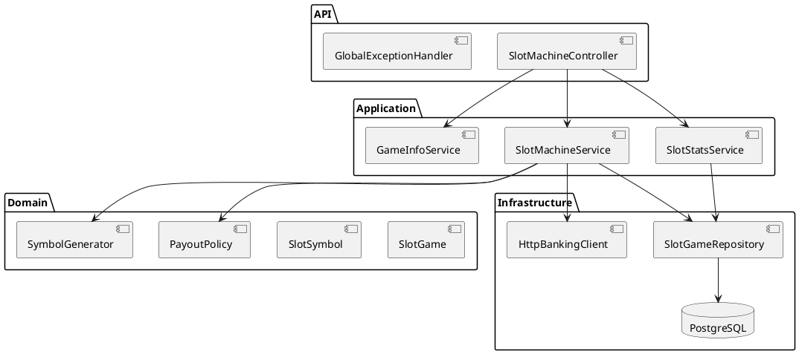

# SPEC-1-Slotmachine-Service

## Background

The casino assignment requires a RESTful slot-machine microservice on port 8082. The uploaded project contained only a generated Spring Boot application class and an incomplete build file. The service therefore needed game logic, banking cooperation, persistence, statistics, API documentation, Docker support, tests, and architecture documentation.

The implementation assumes a three-reel game, a bet supplied by the client, and one net banking transaction per round. The existing banking service currently exposes its transaction controller below `/api`; this path is configurable so the group can switch to the assignment path without code changes.

## Requirements

- **Must**
  - Provide all slot-machine endpoints from the assignment below `/casino/slots/api`.
  - Verify the user and update the balance through the banking service.
  - Store game history in a dedicated PostgreSQL database using `Long` identifiers.
  - Represent money with `BigDecimal` and no more than two decimal places.
  - Use layered Spring Boot architecture, dependency injection, JPA, validation, Maven, JUnit, Mockito, Docker, Swagger UI, and PlantUML.
  - Return 400 for invalid play requests, 404 for unknown users/games, and avoid persisting a game when banking rejects the transaction.
- **Should**
  - Make randomness injectable so tests are deterministic.
  - Keep domain entities valid throughout their lifetime.
  - Expose reproducible probability, RTP, and house-edge calculations.
  - Apply short banking timeouts and return 502 for dependency failures.
  - Produce JaCoCo coverage reports.
- **Could**
  - Add an idempotency key and outbox workflow after the banking API supports them.
  - Move aggregate statistics to database projections if game volume becomes large.
- **Won't (MVP)**
  - Reverse a banking transaction when a history entry is deleted.
  - Guarantee distributed atomicity between the banking database and slot database; the current banking API has no idempotency or reservation protocol.

## Method

A layered architecture separates HTTP, application logic, domain logic, external integration, and persistence.



### Database schema

```sql
CREATE TABLE slot_games (
    id BIGSERIAL PRIMARY KEY,
    user_id BIGINT NOT NULL,
    bet NUMERIC(12,2) NOT NULL,
    payout NUMERIC(14,2) NOT NULL,
    amount NUMERIC(14,2) NOT NULL,
    winning BOOLEAN NOT NULL,
    reel_one VARCHAR(16) NOT NULL,
    reel_two VARCHAR(16) NOT NULL,
    reel_three VARCHAR(16) NOT NULL,
    played_at TIMESTAMP WITH TIME ZONE NOT NULL
);

CREATE INDEX idx_slot_games_user_id ON slot_games(user_id);
CREATE INDEX idx_slot_games_played_at ON slot_games(played_at);
```

### Play algorithm

1. Validate `user` and `bet` (`0.01` to `1000.00`, maximum two decimal places).
2. Fetch the user from banking and reject insufficient balance.
3. Draw three independent weighted symbols.
4. If all symbols match, calculate `payout = bet × symbol multiplier`; otherwise payout is zero.
5. Calculate `amount = payout - bet`.
6. Send one banking transaction with that net amount.
7. Persist and return the game only after banking accepts the transaction.

The symbol table is:

| Symbol | Weight | Triple payout |
|---|---:|---:|
| CHERRY | 30 | 11x |
| LEMON | 25 | 15x |
| ORANGE | 20 | 21x |
| BELL | 12 | 50x |
| BAR | 8 | 110x |
| SEVEN | 5 | 550x |

This produces a 5.2990% hit rate, 91.0845% theoretical RTP, and 8.9155% theoretical house edge.

## Implementation

1. Replace the generated POM with Spring Boot 4.0.7 dependencies for Web MVC, RestClient, JPA, validation, PostgreSQL, Swagger, H2 tests, and JaCoCo.
2. Add controller, DTO, exception, service, domain, repository, client, and configuration packages.
3. Configure PostgreSQL, port 8082, Swagger UI, banking paths, and network timeouts through environment variables.
4. Add deterministic unit and HTTP contract tests for payout rules, weighted selection, play orchestration, statistics, controller behavior, and banking requests.
5. Add a multi-stage non-root Docker image and a local Compose file with a dedicated PostgreSQL container.
6. Add component and sequence PlantUML diagrams plus service usage documentation.

## Milestones

- **M1 - Domain and API:** game model, payout table, validation, all required endpoints.
- **M2 - Integration and persistence:** PostgreSQL repository and banking REST client.
- **M3 - Quality:** unit/controller/client tests and JaCoCo reporting.
- **M4 - Delivery:** Docker/Compose, Swagger UI, README, and PlantUML diagrams.
- **M5 - Group integration:** align the banking transaction base path, run all six containers, and execute an end-to-end play scenario.

## Gathering Results

Acceptance checks:

- `./mvnw clean verify` succeeds and produces a JaCoCo report.
- Swagger UI lists all eight required slot endpoints.
- A valid losing play decreases the banking balance by exactly the bet and stores one game.
- A valid winning play applies exactly `payout - bet` and stores the three symbols.
- Invalid bets return 400; unknown users/games return 404; banking outages return 502.
- `/stats`, `/stats/user/{id}`, and `/stats/games` match stored games.
- `docker compose up --build` starts the service and its dedicated PostgreSQL database without local Java or Maven installation.

Post-production indicators should include request success rate, banking latency/error rate, database latency, game count, total turnover, actual RTP, and differences between actual and theoretical RTP over increasing sample sizes.

## Need Professional Help in Developing Your Architecture?

Please contact me at [sammuti.com](https://sammuti.com) :)
